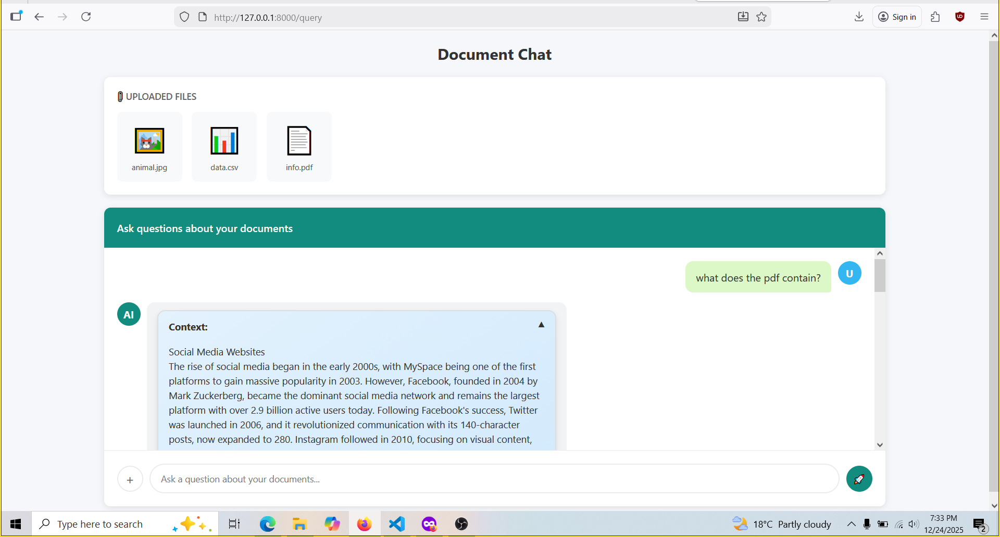

# Document Q&A with FastAPI & Gemini

A simple Retrieval-Augmented Generation (RAG) API for asking questions about uploaded documents (PDF, DOCX, TXT, JPG). Uses FastAPI, Google Gemini embeddings and Chroma vector database.

## ✨ Features
- Upload multiple files (PDF, DOCX, TXT, JPG , PNG, CSV, DB)
- Ask questions
- Get answers with exact source and context

## Installation
  pip install -r requirements.txt

## 🚀 Quick Start/Run
  For development(locally): fastapi dev main.py

## How to use it?
    - Upload all the files at once at the very beginning.
    - Ask questions.

## API Documentation
    - ('/') -> returns index.html
    - ('/query') -> returns query.html
    - ('/api/query') -> makes a POST request to the backend with user's questions and gets the response in return

## Screenshots

## Cons
    - Once you reload the page , the messages are gone. No way to retrieve them back.

